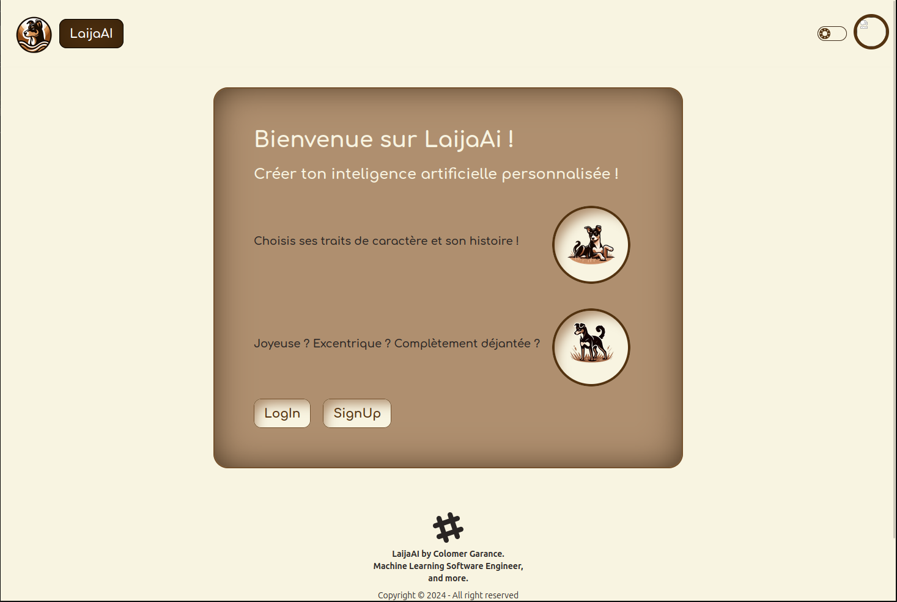

# Laija AI

## Description



Laija AI est une application web permettant d'interagir avec une intelligence artificielle capable d'incarner un personnage non-joueur (PNJ). L'utilisateur définit les traits de personnalité du PNJ à l'aide d'adjectifs et lui attribue une backstory. L'IA interprète ces informations et génère des réponses cohérentes avec le personnage défini.

## Fonctionnalités

- **Personnalisation du PNJ**
  - Sélection d'adjectifs pour définir le comportement
  - Attribution d'une backstory pour enrichir le rôle du PNJ
  
- **Interaction en temps réel**
  - Discussions avec une IA interprétant le personnage
  - Réponses adaptées en fonction des paramètres définis

## Stack Technique

- **Frontend** : React avec DaisyUI et TailwindCSS
- **Backend** : Django
- **API IA** : FastAPI

## État du projet

Le projet est en cours de développement. Certaines fonctionnalités peuvent être incomplètes ou sujettes à modification.

## Installation et Exécution

### Prérequis

- Node.js (version compatible avec React)
- Python (version compatible avec Django et FastAPI)
- Poetry pour la gestion des dépendances
- PostgreSQL

### Lancer l'application

1. Installer les dépendances du frontend :
   ```sh
   cd frontend
   npm install
   npm run dev
   ```

2. Installer les dépendances backend avec Poetry et démarrer Django :
   ```sh
   cd backend
   poetry install
   poetry run python manage.py runserver
   ```

3. Lancer l'API IA avec FastAPI :
   ```sh
   cd ai_api
   poetry install
   poetry run uvicorn main:app --reload
   ```

## Déploiement

L'application pourra être conteneurisée avec Docker et déployée via un orchestrateur adapté. Les configurations seront définies ultérieurement.

## Contributions

Le projet est en développement actif. Toute contribution est la bienvenue pour améliorer les fonctionnalités et optimiser les performances.

## Licence

N/A.

